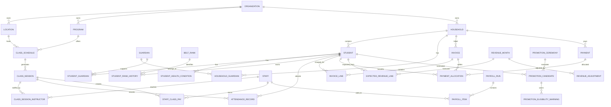

# Emirates Bando Data Model

## Design principles

- The household is the billing and family communication anchor. A household can contain many students and guardians.
- A student has no profile-photo field by design.
- Expected revenue is a monthly planning ledger. Invoices are amounts charged. Payments are cash actually received. These are intentionally separate.
- Financial records are archived or voided, not physically deleted. Application services must reject hard-delete operations for financial models.
- Audit logs are append-only. Every create, material update, approval, rejection, archive, restore, and void operation must write an `AuditLog` in the same database transaction.
- All money is stored as PostgreSQL `numeric(12,2)` through Prisma `Decimal`; the default currency is AED.
- Dates use `date`, times use `time`, and events use timezone-aware timestamps.

## Entity relationships

## Core connections

### Families and students

`Household` owns family billing details and connects to many `Student` records. `Guardian` is reusable across households and students through explicit join tables, allowing pickup, legal-guardian, billing-contact, and communication permissions to differ.

Emergency contacts can be household-wide or student-specific. Health conditions remain student-specific and carry severity, action plans, medication, and confidentiality.

### Leads and trials

`Lead` tracks prospect source, follow-up state, and conversion. A lead can have multiple `Trial` visits. A converted lead points to the resulting `Student`; a trial can also point to the class session attended.

### Martial arts progression

`BeltRank` defines the ordered rank catalog. `StudentRankHistory` preserves every award and marks the current rank. `PromotionCeremony` groups candidates; each candidate stores the proposed rank movement and generated `PromotionEligibilityWarning` records for attendance, time-at-rank, missing documents, unpaid balances, health restrictions, or instructor review.

### Classes and attendance

`ClassSchedule` is the repeating timetable and owns capacity. `ClassSession` is the dated occurrence and snapshots capacity, location, program, and time. Lead and assistant instructors are represented by `ClassSessionInstructor.isLead`. Attendance therefore reports accurately by date, class, location, program, instructor, assistant instructor, and student.

### Equipment and inventory

`InventoryItem` represents uniform or glove stock by SKU, size, and location. `InventoryTransaction` is the stock ledger. `StudentEquipment` tracks each student's required, ordered, issued, returned, lost, damaged, or replaced equipment.

### Documents

`DocumentType` defines required checklist items. `StudentDocumentRequirement` is the per-student checklist state. `Document` stores metadata and an external object-storage key; file bytes do not belong in PostgreSQL.

### Finance

`ExpectedRevenueLine` is a monthly snapshot generated from active enrollments and tuition rates. It can be excluded for Traveling, On Leave, Injured, full-month absence, withdrawal, scholarship, or a documented manual reason. `RevenueAdjustment` changes the monthly forecast without rewriting student lines.

`Invoice` and `InvoiceLine` represent charges. `Payment` represents money received and requires a seeded Cash or Online Transfer mode. `PaymentAllocation` can divide one family payment among multiple students, invoices, or payment-plan installments.

`PaymentPlan` belongs to a household, may cover several students, and contains dated installments. Expenses and recurring expenses have approval and archive fields.

### Staff and payroll

`StaffClassPay` snapshots the agreed rate and amount per completed class, so later rate changes do not rewrite history. `PayrollRun` and `PayrollItem` aggregate those entries and record submission, approval, rejection, and payment states. Certifications and expiry dates are tracked independently.

### Audit

`AuditLog` stores actor, entity, action, before/after JSON, changed fields, request metadata, and reason. Audit creation belongs in the application's transaction layer or a Prisma Client extension; database access should be restricted so normal application roles cannot bypass that layer.

## Production migration constraints

Prisma models express the portable structure. The first SQL migration should additionally add PostgreSQL checks and partial indexes for rules that Prisma schema syntax cannot fully encode:

- positive capacities, quantities, rates, installments, and monetary values where appropriate;
- `endTime > startTime`, `periodEnd >= periodStart`, and end dates not before start dates;
- payment allocations may not exceed the payment amount;
- exactly one current rank per student via a partial unique index on `student_rank_history(student_id) WHERE is_current`;
- at most one lead instructor per class schedule and class session via partial unique indexes;
- finance-table hard deletes denied to the application database role;
- audit-log updates and deletes denied to the application database role;
- deferred balance validation triggers for invoice/payment/payment-plan totals when transaction-level consistency is required.

## Seeded reference data

- Locations: Cricket Stadium / Khalifa City A; Nabdh Al Falah.
- Programs: Males; Females.
- Fees: AED 200 monthly once-weekly tuition; AED 400 monthly twice-weekly tuition; AED 100 uniform; AED 100 gloves.
- Payment modes: Cash; Online Transfer.
- Document types: student and guardian identity, passport, medical declaration, consent, staff identity, martial arts certification, and first aid.
- Default ranks: White, Yellow, Orange, Green, Blue, Brown, Black.

The rank sequence is a configurable initial catalog. Confirm the official Emirates Bando grading order and minimum attendance/time requirements before production launch.
